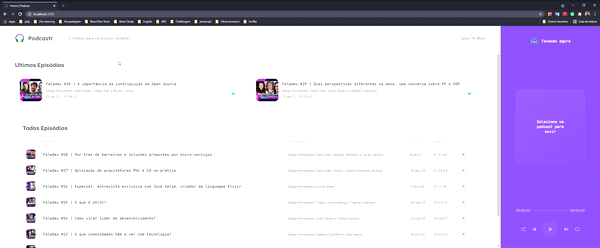

<h1 align="center">
    
</h1>

<p align="center">
  <a href="./LICENSE">
  
  </a>
  
  
  
  
  
  
  
</p>


<br>

<p align="center">
  
</p>

<br>
<br>

## 🎥 Showcase

<p align="center">
  
</p>

<br>

## ⚙ Technologies

This project was developed using the following technologies:


[](https://sass-lang.com/)

[](https://nextjs.org/)

[](https://reactjs.org)

[](https://www.typescriptlang.org/)

  


<br>


## 🚀 Getting started


Follow the steps below 📝
```bash
# Install the dependencies
$ yarn

# Run the JSON server
$ yarn server

# Start the project
$ yarn dev
```

The app will be available for access on your browser at http://localhost:3000

## 💻 Project

[Podcastr](https://podcastr-nlw.vercel.app/) to bring you even closer to the best technology podcasts! 💜 

This is a project developed during the **[Next Level Week](https://nextlevelweek.com/)**, presented by **[@Rocketseat](https://github.com/Rocketseat)**.

## 🔖 Layout

You can view the project layout through the links below:

- [Layout Web](https://www.figma.com/file/UwFEntsHpHYJlHNQAQr4gA/Podcastr?node-id=160%3A2761) 

Remembering that you need to have a [Figma](http://figma.com/) account to access it.

## 📱 Contact

Contact me by email or LinkedIn:

<a href="mailto:gabriel.augusto99@hotmail.com"></a>

<a href="https://www.linkedin.com/in/gabriel-augusto-soler-stresser-366719100/"></a>

## 📝 License

This project is licensed under the MIT License. See the [LICENSE](LICENSE.md) file for details.


---

<p align="center">Made with 💜 by Gabriel Stresser</p>
